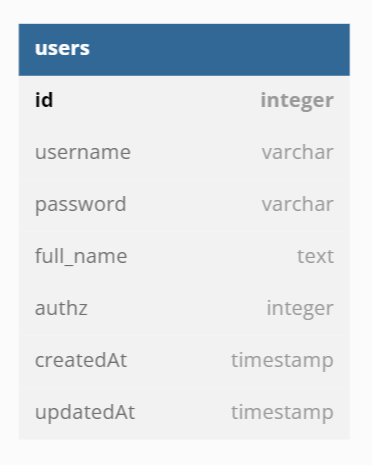

# Challenge Chapter 4 - Car Management Dasboard

This project is about implemetation of Database, Orm and Restful API.

## Database Diagram

## Hyperlink

- Akses Homepage/Get All data = http://hostname/
- Akses Halaman Create mobil = http://hostname/Car
- Akses Halaman Edit Mobil = http://hostname/Car/:id

## API Endpoint
- untuk akses API, set header key insomnia dengan value true
- Create data mobil baru = POST `http://hostname/Car`
- Get semua data mobil = GET `http://hostname/`
- Get satu data mobil = GET `http://hostname/Car/:id`
- Delete satu data mobil = DELETE `http://hostname/Car/:id`
- Update satu data mobil = PUT `http://hostname/Car/:id`
